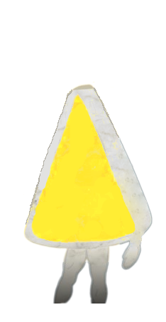

(Badges
work in progress...)

# Trivial Pursuit

Ricreato in codice il gioco di domande e risposte più famoso del mondo!
Il gioco d tavolo con un aspetto retro anni 80', giocaci ora ;) 

"Lo svantaggio di vincere il Nobel è la figuraccia che fai quando poi perdi a Trivial Pursuit" -Daniele Luttazzi

## Demo
https://trivialers.github.io/

linea

## Autori
Ideato, progettato e realizzato da 
- Simone Rodolfi (• . •)¿
- Sara Zhan (:◎)≡
